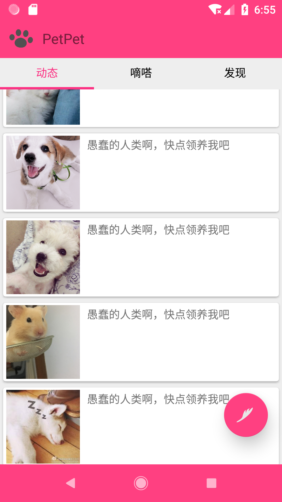
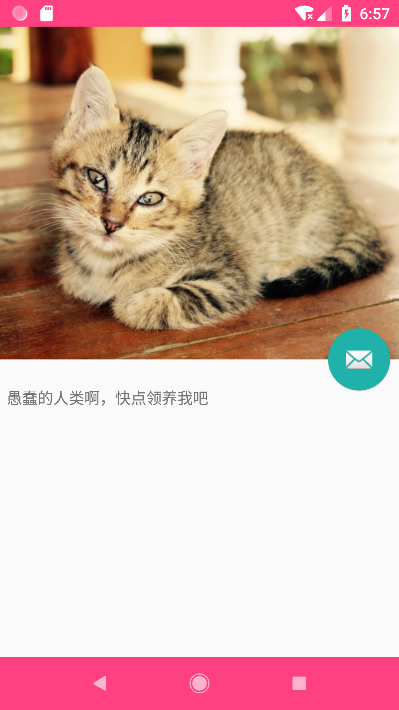
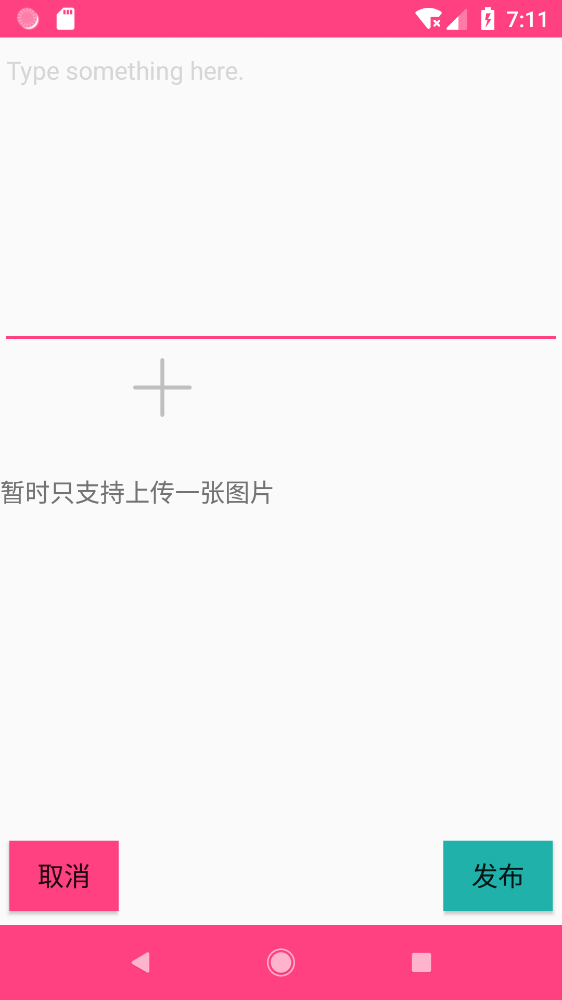
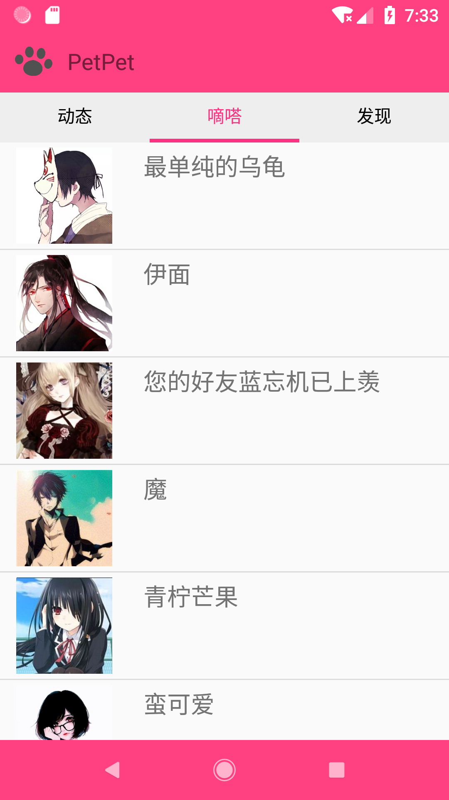
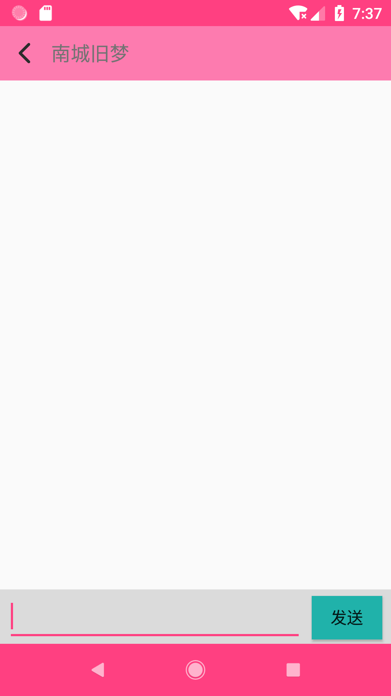

# Pets-Platform
`Java` &nbsp; `Android`

This project is a platform about pet info and consists of Java Server and Android client. To be honest, it is more like a attempt and demo because it's my first Android large assignment in Internet Programming Course. The whole project is supported by my crude ideas. But I still share it here for it's my small achievement and I regard it as my first further explore in Android. Though it is simple and naive, it can communicate between server and client. And I have designed and implement a UI which looks okay for it. 

## General design
__App:__ 

&emsp;&emsp;app中的所有网络数据传输都基于同一个socket，即所有界面共享一个socket，具体实现就是自定义一个包含Socket的类并继承Application类，Application类是Android里的实体类，它的生命周期覆盖到整个app的运行周期，同时该类中的数据可以被所有Activity和Fragment共享拿到，使用这种方式来设计网络数据传输是一种比较优良的方式，该类不断与服务器交换数据，并把数据存放在其内部的各个变量中，等待各个界面来自己调取，app的数据传输流是DataOutputStream与DataInputStream。界面部分分为三个Fragment和四个Activity，合并之后组成了该app的六个界面，界面中既有RecylerView、ListView这种列表视图，也有CoordinatorLayout以及ToolBar，可以用来实现视差效果，举个例子就是微信朋友圈在上滑时的效果，但它的视差不明显，或者说根本没有。除此之外，为了实现左右滑动切换页面的效果，我还使用了ViewPager，通过一系列重写方法可以实现比较好看的效果，类似于旧版微信滑动切换界面时顶部滑动的指示器。

__Server:__

&emsp;&emsp;服务器开了线程池，在用户登录之后会将每个用户对应的socket维护在一个ArrayList中，若有聊天信息发来，则会从该list中查询相应的socket进行消息发送。用户在打开软件时会向服务器请求数据，服务器则从数据库中拿出相应数据传输给客户端。

## The functions it implemented
__1. Pet info preview__

  &emsp;&emsp;The main interface and the beginning of APP. Every item in this interface shows a picture and some simple info of pet.

__2. Detailed info show__

  &emsp;&emsp;Jump from the item of main interface. Shows the detailed info of pet.

__3. Deliver pet info__

  &emsp;&emsp;Release the info about pets. You can upload picture from your local phoot album but not video and audio.

__4. Community communication__

  &emsp;&emsp;There is a interface used for chatting.

## Here are the UI

__1. main interface__

  

__2. detail info interface__
  
  
  
__3. delivering info interface__

  
  
__4. contact interface__

  
  
__5. chatting interface__

  
  

